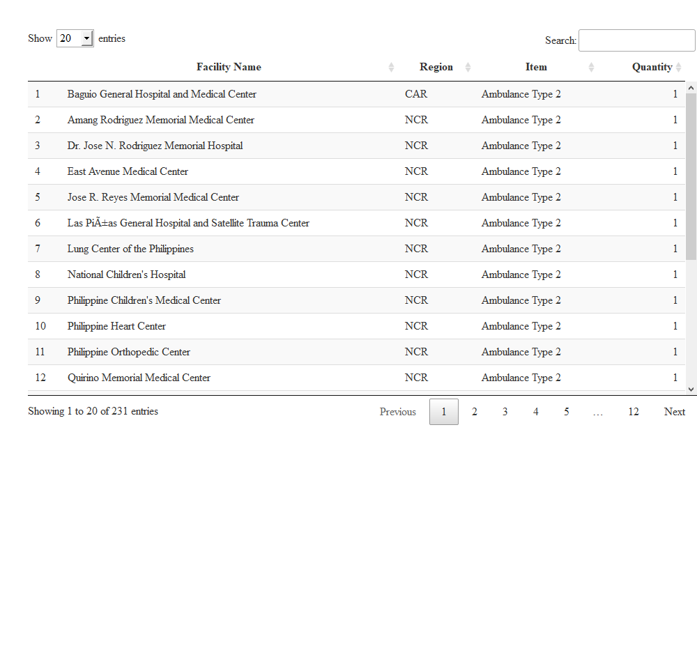
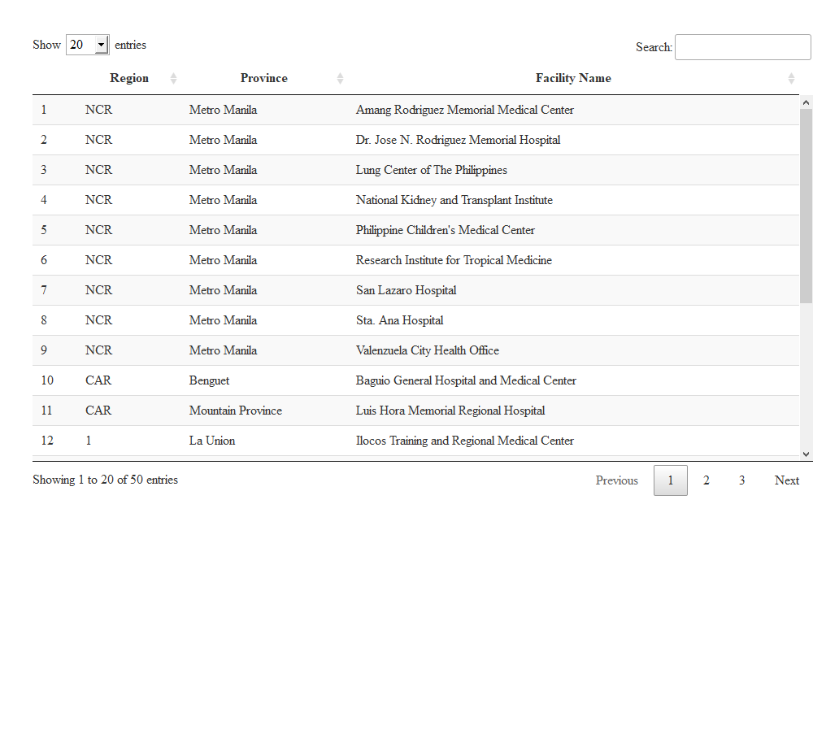

```r
source("libraries.R")
source("project_recipients.R")
source("project_indicators.R")
```

# Project Description

The Philippines COVID-19 Emergency Response Project (PCERP), with the
Project Development Objective (PDO) to strengthen the Philippines'
capacity to prevent, detect, and respond to the threat posed by COVID-19
and strengthen national systems for public health preparedness, was
approved by the World Bank on 22 April 2020.

Despite recent progress, the Philippines remains one of the countries
most affected by the COVID-19 in East Asia and Pacific, rendering
vaccine purchase and deployment a national priority. With the
availability of vaccines, the Philippines has now an opportunity to add
a significant new layer to its COVID-19 emergency response. Procuring
and administering vaccines is critical to reducing mortality from COVID,
opening the economy in earnest and arresting the decline in GDP,
employment and incomes. Hence, Additional Financing (AF) was sought by
the country to enable affordable and equitable access to COVID-19
vaccines and help ensure effective vaccine deployment in the country
through an enhanced vaccination system and to further strengthen
preparedness and response activities.

The original approved loan financing of US\$ 100 Million (Loan no.
9105-PH) had been increased by US\$ 500 Million through the Additional
Financing in 19 March 2021, to cover the procurement of vaccines against
COVID- 19 and to support the DOH National Deployment and Vaccination
Plan (NDVP) (Loan no. 9220-PH). The new total of the Project financing
is US\$ 600 Million.

The expected project beneficiaries will be the general population,
including infected people, at-risk populations, particularly the elderly
and people with chronic conditions, medical and emergency personnel,
medical and testing facilities, and public health agencies engaged in
the response.

The project is comprised of the following four components:

Component 1: Strengthening Emergency COVID-19 Health Care Response (US\$
577,117,000) with the following sub-component:<br>          1.1
Provision of medical and laboratory equipment and reagents;<br>         
1.2 Provision of medical supplies, including Personal Protective
Equipment (PPE), medical countermeasures, COVID-19 vaccines, medicines,
and ambulances;<br>          1.3 Regular and intensive care isolation
rooms with negative pressure;<br>          1.4 Deployment of COVID-19
vaccines (new sub-component, financed by counterpart funding from the
GOP

Component 2: Strengthening laboratory capacity at national and
sub-national level to support Emerging Infectious Diseases (EIDs)
Prevention, Preparedness, and Response (US\$ 15,678,000): It includes
improving, retrofitting, and refurbishing one national reference
laboratory--the Research Institute for Tropical Medicine (RITM)---as
well as six sub-national and public health laboratories in Baguio, Cebu,
Davao, Surigao City, and Manila;

Component 3: Implementation Management and Monitoring and Evaluation
(US\$ 7,205,000): This component supports project management and
monitoring, including the creation of a project management team and
development of project monitoring and evaluation system; and

Component 4: Contingent Emergency Response Component (CERC) (US\$0),
which supports immediate response to an eligible crisis or health
emergency.

The Project Operations Manual (DOH Department Circular no. 2021-0142),
Project's Implementation Arrangements (DOH Department Order no.
2021-0205), Guidelines on the Project's Civil Works Implementation (DOH
Department Circular no. 2020-0398), and the PCERP Contingency Emergency
Response Component -- Emergency Response Operations Manual [CERC--EROM]
(DOH Department Circular no. 2021-0314) are available in the resources
tab.

The closing date of the Project is on December 29, 2023.


# Project Recipients
The following are the tentative recipients of the goods covered by the
PCERP:


### Equipment

```r
recipients_equipment%>%
  filter(project_description %in% c("Mechanical Ventilator",
                                    "Ambulance Type 2",
                                    "Infusion Pump",
                                    "Portable X-ray")
         )%>%
  select(facility_name,
         region,
         project_description,
         quantity)%>%
  arrange(project_description)%>%
  # mutate(facility_name = facility_name%>%
  #          str_replace_all("ñ", "\\ñ"))%>%
  DT::datatable(
    colnames = c("Item" = "project_description",
                 "Region" = "region",
                 "Facility Name" = "facility_name",
                 "Quantity" = "quantity"),
    height = 850,
    options = list(
      scrollY = "450px",
      columnDefs = list(
        list(
          className = 'dt-center')
        ),
      pageLength = 20
      )
    )
```


### RT PCR

```r
rt_pcr%>%
  DT::datatable(
    colnames = c(
      "Province" = "province",
      "Region" = "region",
      "Facility Name" = "facility_name"
    ),
    height = 850,
    options = list(
      scrollY = "450px",
      columnDefs = list(
        list(
          className = 'dt-center')
        ),
      pageLength = 20
      )
    )
```




## Leaflet here
**Map here**


# Environmental and Social Framework (ESF)

The Environmental and Social Management Framework (ESMF):

-   is an instrument that examines risks and impacts of the project and
    its components which cannot be determined until the program or the
    subproject details have been identified

-   describes principles, processes and technical guidance to the
    Project implementing agencies and their consultants to assess the
    environmental and social (E&S) risks and impacts of the Project
    activities

-   developed in accordance with the World Bank's Environmental and
    Social Standards (ESSs)

The Environmental and Social Standards (ESS) include:


```r
tibble(
  col1 = paste0("ESS", 1:10),
  col2 = c(
    "Assessment and Management of Environmental and Social Risks and Impacts",
    "Labor and Working Conditions",
    "Resource Efficiency and Pollution Prevention and Management",
    "Community Health and Safety",
    "Land Acquisition, Restrictions on the Land Use and Involuntary Resettlement",
    "Biodiversity Conservation and Sustainable Management
of Living Natural Resources",
"Indigenous Peoples/Sub-Saharan African Historically Underserved Traditional Local Communities",
"Cultural Heritage",
"Financial Intermediaries",
"Stakeholder Engagement and Information Disclosure"
  )
)%>%
  kbl(col.names = NULL)%>%
  column_spec(1:2,
              border_left = T,
              border_right = T)%>%
  kable_styling("striped")
```

<table class="table table-striped" style="margin-left: auto; margin-right: auto;">
<tbody>
  <tr>
   <td style="text-align:left;border-left:1px solid;border-right:1px solid;"> ESS1 </td>
   <td style="text-align:left;border-left:1px solid;border-right:1px solid;"> Assessment and Management of Environmental and Social Risks and Impacts </td>
  </tr>
  <tr>
   <td style="text-align:left;border-left:1px solid;border-right:1px solid;"> ESS2 </td>
   <td style="text-align:left;border-left:1px solid;border-right:1px solid;"> Labor and Working Conditions </td>
  </tr>
  <tr>
   <td style="text-align:left;border-left:1px solid;border-right:1px solid;"> ESS3 </td>
   <td style="text-align:left;border-left:1px solid;border-right:1px solid;"> Resource Efficiency and Pollution Prevention and Management </td>
  </tr>
  <tr>
   <td style="text-align:left;border-left:1px solid;border-right:1px solid;"> ESS4 </td>
   <td style="text-align:left;border-left:1px solid;border-right:1px solid;"> Community Health and Safety </td>
  </tr>
  <tr>
   <td style="text-align:left;border-left:1px solid;border-right:1px solid;"> ESS5 </td>
   <td style="text-align:left;border-left:1px solid;border-right:1px solid;"> Land Acquisition, Restrictions on the Land Use and Involuntary Resettlement </td>
  </tr>
  <tr>
   <td style="text-align:left;border-left:1px solid;border-right:1px solid;"> ESS6 </td>
   <td style="text-align:left;border-left:1px solid;border-right:1px solid;"> Biodiversity Conservation and Sustainable Management
of Living Natural Resources </td>
  </tr>
  <tr>
   <td style="text-align:left;border-left:1px solid;border-right:1px solid;"> ESS7 </td>
   <td style="text-align:left;border-left:1px solid;border-right:1px solid;"> Indigenous Peoples/Sub-Saharan African Historically Underserved Traditional Local Communities </td>
  </tr>
  <tr>
   <td style="text-align:left;border-left:1px solid;border-right:1px solid;"> ESS8 </td>
   <td style="text-align:left;border-left:1px solid;border-right:1px solid;"> Cultural Heritage </td>
  </tr>
  <tr>
   <td style="text-align:left;border-left:1px solid;border-right:1px solid;"> ESS9 </td>
   <td style="text-align:left;border-left:1px solid;border-right:1px solid;"> Financial Intermediaries </td>
  </tr>
  <tr>
   <td style="text-align:left;border-left:1px solid;border-right:1px solid;"> ESS10 </td>
   <td style="text-align:left;border-left:1px solid;border-right:1px solid;"> Stakeholder Engagement and Information Disclosure </td>
  </tr>
</tbody>
</table>

\~ESS 5,6,8,and 9 are not related to the Project.\~

The objectives of the ESMF are as follows:

-   assess potential E&S risks and impacts of the Project & propose
    mitigation measures for risks/impacts

-   establish clear procedures for the E&S screening, review, approval,
    and implementation of activities

-   specify appropriate roles and responsibilities, and outline the
    necessary reporting procedures

-   identify the training and capacity building needed to successfully
    implement the provisions of the ESMF

-   address mechanisms for public consultation and disclosure of project
    documents as well as redress of possible grievance f. establish the
    budget requirement for implementation of the ESMF

# Results Framework Indicators

### The Project's Results Framework Indicators for the Parent Project (Original Loan) and Additional Financing are as follows:

**A. Project Development Objective Indicators**


```r
PDI%>%
    kbl(booktabs = T, format = "html", align = "l")%>%kable_styling(full_width = T)
```

<table class="table" style="margin-left: auto; margin-right: auto;">
 <thead>
  <tr>
   <th style="text-align:left;"> Indicators </th>
   <th style="text-align:left;"> Target (2021) </th>
   <th style="text-align:left;"> Status </th>
  </tr>
 </thead>
<tbody>
  <tr>
   <td style="text-align:left;"> Percentage of hospitals with personal protective equipment and infection control products and supplies according to DOH requirements, without stock-outs in preceding one month </td>
   <td style="text-align:left;"> 65% </td>
   <td style="text-align:left;"> 80% </td>
  </tr>
  <tr>
   <td style="text-align:left;"> Percentage of designated laboratories with COVID-19 diagnostic equipment, test kits, and reagents, without stock-outs in preceding one month </td>
   <td style="text-align:left;"> 50% </td>
   <td style="text-align:left;"> 71% </td>
  </tr>
  <tr>
   <td style="text-align:left;"> Number of acute healthcare facilities with isolation capacity according to DOH-established standards </td>
   <td style="text-align:left;"> 40 </td>
   <td style="text-align:left;"> 43 </td>
  </tr>
  <tr>
   <td style="text-align:left;"> Share of project-targeted health workers received COVID vaccine </td>
   <td style="text-align:left;"> 80% </td>
   <td style="text-align:left;"> 92% </td>
  </tr>
  <tr>
   <td style="text-align:left;"> Share of project-targeted population given full dose of COVID-19 vaccination </td>
   <td style="text-align:left;"> 70% </td>
   <td style="text-align:left;"> 82% </td>
  </tr>
</tbody>
</table>
**B. Intermediate Results Indicators**


```r
IRI$`Strengthening Emergency COVID-19 Health Care Response`%>%
    kbl(booktabs = T, format = "html", align = "l", caption = "Strengthening Emergency COVID-19 Health Care Response")%>%kable_styling(full_width = T)
```

<table class="table" style="margin-left: auto; margin-right: auto;">
<caption>Strengthening Emergency COVID-19 Health Care Response</caption>
 <thead>
  <tr>
   <th style="text-align:left;"> Indicators </th>
   <th style="text-align:left;"> Target (2021) </th>
   <th style="text-align:left;"> Status </th>
  </tr>
 </thead>
<tbody>
  <tr>
   <td style="text-align:left;"> Standard design for hospital isolation and treatment centers to manage Severe Acute Respiratory Infections (SARI) patients is finalized (Yes/No) </td>
   <td style="text-align:left;"> Yes </td>
   <td style="text-align:left;"> Yes </td>
  </tr>
  <tr>
   <td style="text-align:left;"> Number of ventilators provided to hospitals </td>
   <td style="text-align:left;"> 500 </td>
   <td style="text-align:left;"> 500 </td>
  </tr>
  <tr>
   <td style="text-align:left;"> Number of health staff trained in infection prevention and control per DOH-approved protocols </td>
   <td style="text-align:left;"> 13000 </td>
   <td style="text-align:left;"> 17505 </td>
  </tr>
  <tr>
   <td style="text-align:left;"> Share of hospitals designated as vaccination sites in project areas having adequate and functioning cold chain equipment (CCE) maintaining the temperature required for the COVID-19 vaccine assigned </td>
   <td style="text-align:left;"> 100% </td>
   <td style="text-align:left;"> 100% </td>
  </tr>
  <tr>
   <td style="text-align:left;"> Share of project-targeted vaccinated population who rated as satisfactory the COVID-19 vaccination service received </td>
   <td style="text-align:left;"> 80% </td>
   <td style="text-align:left;"> 97% </td>
  </tr>
  <tr>
   <td style="text-align:left;"> Share of project-targeted population reporting adverse event following immunization (AEFI) having received additional care and free treatment </td>
   <td style="text-align:left;"> 80% </td>
   <td style="text-align:left;"> 74% </td>
  </tr>
  <tr>
   <td style="text-align:left;"> National COVID-19 vaccination tools developed </td>
   <td style="text-align:left;"> Yes </td>
   <td style="text-align:left;"> Yes </td>
  </tr>
  <tr>
   <td style="text-align:left;"> Eligibility for vaccination criteria include barangay health workers (BHWs) among priority group </td>
   <td style="text-align:left;"> Yes </td>
   <td style="text-align:left;"> Yes </td>
  </tr>
</tbody>
</table>

```r
IRI$`Strengthening Laboratory Capacity at National and Sub-National Level`%>%
    kbl(booktabs = T, format = "html", align = "l", caption = "Strengthening Emergency COVID-19 Health Care Response")%>%kable_styling(full_width = T)
```

<table class="table" style="margin-left: auto; margin-right: auto;">
<caption>Strengthening Emergency COVID-19 Health Care Response</caption>
 <thead>
  <tr>
   <th style="text-align:left;"> Indicators </th>
   <th style="text-align:left;"> Target (2021) </th>
   <th style="text-align:left;"> Status </th>
  </tr>
 </thead>
<tbody>
  <tr>
   <td style="text-align:left;"> Daily capacity of a designated national laboratory (RITM) in conducting COVID-19 diagnostic tests </td>
   <td style="text-align:left;"> 1200 </td>
   <td style="text-align:left;"> 117 </td>
  </tr>
  <tr>
   <td style="text-align:left;"> Daily capacity of a designated sub-national laboratory (Davao) in conducting COVID-19 diagnostic tests </td>
   <td style="text-align:left;"> 500 </td>
   <td style="text-align:left;"> 459 </td>
  </tr>
  <tr>
   <td style="text-align:left;"> Daily capacity of a designated sub-national laboratory (Cebu) in conducting COVID-19 diagnostic tests </td>
   <td style="text-align:left;"> 500 </td>
   <td style="text-align:left;"> 465 </td>
  </tr>
</tbody>
</table>

```r
IRI$`Implementation Management and Monitoring and Evaluation`%>%
    kbl(booktabs = T, format = "html", align = "l", caption = "Strengthening Emergency COVID-19 Health Care Response")%>%kable_styling(full_width = T)
```

<table class="table" style="margin-left: auto; margin-right: auto;">
<caption>Strengthening Emergency COVID-19 Health Care Response</caption>
 <thead>
  <tr>
   <th style="text-align:left;"> Indicators </th>
   <th style="text-align:left;"> Target (2021) </th>
   <th style="text-align:left;"> Status </th>
  </tr>
 </thead>
<tbody>
  <tr>
   <td style="text-align:left;"> M&amp;E system established to monitor project activities </td>
   <td style="text-align:left;"> Yes </td>
   <td style="text-align:left;"> Yes </td>
  </tr>
  <tr>
   <td style="text-align:left;"> Functional asset management system is in place, independently reviewed on 6-monthly basis </td>
   <td style="text-align:left;"> Yes </td>
   <td style="text-align:left;"> Yes </td>
  </tr>
  <tr>
   <td style="text-align:left;"> Percentage of grievances resolved to the satisfaction of the complainant within timeframe specified in the GRM for stakeholders </td>
   <td style="text-align:left;"> 80% </td>
   <td style="text-align:left;"> 100% </td>
  </tr>
</tbody>
</table>


# Resources

## Project Dashboard
For more information on the Project indicators and the Project at large please visit our [Project Dashboard](https://doh.gov.ph/COVID-19/emergency-response-project/dashboard)

## Downloadable Files
[Project Operations Manual](https://doh.gov.ph/sites/default/files/basic-page/DC%20NO.%202021-0142%20UPDATED%20POM.pdf)
<br>
[Project's Implementation Arrangement](https://doh.gov.ph/sites/default/files/basic-page/DEPARTMENT%20ORDER%20NO.%202021-0205%20IMPLEMENTATION%20ARRANGEMENT.pdf)
<br>
[Guidelines on the Project's Civil Works Implementation](https://doh.gov.ph/sites/default/files/basic-page/dc2020-0398.pdf)
<br>
[Contingency Emergency Response Component -- Emergency Response Operations Manual]()
<br>
[Stakeholder Engagement Plan (SEP) November 22, 2022](https://doh.gov.ph/sites/default/files/basic-page/SEP-nov-22-2021.pdf)
<br>
[Environmental and Social Commitment Plan (ESCP) November 22, 2022](https://doh.gov.ph/sites/default/files/basic-page/ESCP-nov-22-2021.pdf)
<br>
[Stakeholder Engagement Plan (SEP) November 03, 2021](https://doh.gov.ph/sites/default/files/basic-page/No%20Watermark_Stakeholder%20Engagement%20Plan%20%28SEP%29_Second%20AF%20PCERP_November%2003%202021.pdf)
<br>
[Environmental and Social Commitment Plan (ESCP) November 03, 2021](https://doh.gov.ph/sites/default/files/basic-page/Environmental%20and%20Social%20Commitment%20Plan%20%28ESCP%29_Second%20AF%20PCERP_November%2003%202021_0.pdf)
<br>
[Stakeholder Engagement Plan (SEP) March 23, 2021](https://doh.gov.ph/sites/default/files/basic-page/SEP%2003172021.pdf)
<br>
[Environmental and Social Commitment Plan (ESCP) March 23, 2021](https://doh.gov.ph/sites/default/files/basic-page/ESCP%2003172021.pdf)
<br>
[Environmental and Social Management Framework (ESMF) March 23, 2021](https://doh.gov.ph/sites/default/files/basic-page/ESMF%2003172021.pdf)
<br>
[Stakeholder Engagement Plan (SEP) February 4, 2021](https://doh.gov.ph/sites/default/files/basic-page/clean%2002042021%20SEP.pdf)
<br>
[Environmental and Social Commitment Plan (ESCP) February 4, 2021](https://doh.gov.ph/sites/default/files/basic-page/02052021%20ESCP%20clean.pdf)
<br>
[Environmental and Social Management Framework (ESMF) February 4, 2021](https://doh.gov.ph/sites/default/files/basic-page/clean%2002042021%20ESMF.pdf)
<br>
[Stakeholder Engagement Plan (SEP) January 8, 2021](https://doh.gov.ph/sites/default/files/basic-page/clean%20rev%2001082021%20SEP-%20vaccine.pdf)
<br>
[Environmental and Social Commitment Plan (ESCP) January 8, 2021](https://doh.gov.ph/sites/default/files/basic-page/clean%20rev%2001082021%20ESCP-%20vaccine.pdf)
<br>
[Environmental and Social Management Framework (ESMF) January 8, 2021](https://doh.gov.ph/sites/default/files/basic-page/clean%20rev%2001082021%20ESCP-%20vaccine.pdf)
<br>
[Stakeholder Engagement Plan (SEP) November 25, 2020]()
<br>
[Environmental and Social Commitment Plan (ESCP) November 25, 2020]()
<br>
[Environmental and Social Management Framework (ESMF) November 25, 2020]()
<br>
[Stakeholder Engagement Plan (SEP) October 9, 2020](https://doh.gov.ph/sites/default/files/basic-page/Stakeholder-Engagement-Plan-v20201009.pdf)
<br>
[Environmental and Social Commitment Plan (ESCP) October 9, 2020](https://doh.gov.ph/sites/default/files/basic-page/Environmental%20and%20Social%20Commitment%20Plan%20%28ESCP%29%20%281%29.pdf)
<br>
[Environmental and Social Management Framework (ESMF) October 9, 2020](https://doh.gov.ph/sites/default/files/basic-page/ESMF%2011252020%20%281%29.pdf)
<br>
[Stakeholder Engagement Plan (SEP) August 4, 2020](https://doh.gov.ph/sites/default/files/basic-page/Stakeholder%20Engagement%20Plan%20%28SEP%29.pdf)
<br>
[Environmental and Social Commitment Plan (ESCP) August 4, 2020](https://doh.gov.ph/sites/default/files/basic-page/Environmental%20and%20Social%20Commitment%20Plan%20%28ESCP%29.pdf)
<br>
[Environmental and Social Management Framework (ESMF) August 4, 2020](https://doh.gov.ph/sites/default/files/basic-page/Environmental%20and%20Social%20Management%20Framework.pdf)
<br>


# Contact us
For inquiries or recommendations, you may contact:<br><br>
<b>On the Project:</b><br>
Mr. Manolito A. Novales<br>
Project Coordinator IV<br>
[manovales\@doh.gov.ph](mailto:manovales@doh.gov.ph){.email}<br>
(02)8651 7800 local 1317<br><br>

<b>On the Environmental and Social Framework:</b><br>
Ms. ⁨Maria Krystell G. Banaag-Año⁩<br
Environmental and Social Safeguards Specialist<br>
[mkbano\@doh.gov.ph](mailto:mkbano@doh.gov.ph){.email}<br>
(02) 8651 7800 local 2324<br><br>

<b>On the Monitoring and Evaluation:</b><br>
Ms. Vega Fria G. Postrano<br>
Monitoring and Evaluation Specialist<br>
[vfgpostrano\@doh.gov.ph](mailto:vfgpostrano@doh.gov.ph){.email}<br>
(02) 8651 7800 local 1453<br>

Mr. John Conrad P. Dacusin<br>
Project Assistant<br>
[jcpdacusin\@doh.gov.ph](mailto:jcpdacusin@doh.gov.ph){.email}<br>
(02)8651 7800 local 1453<br>

Mr. Mark Benedict K. Mortera<br>
Project Assistant<br>
[mbkmortera\@doh.gov.ph](mailto:mbkmortera@doh.gov.ph){.email}<br>
(02)8651 7800 local 1453<br><br>

<b>On the Deployment of the Project Procured Vaccines</b><br>
Ms. Hannah P. Jara<br>
Project Assistant<br>
hpjara@doh.gov.ph<br>
(02) 8651 7800 local 2361
